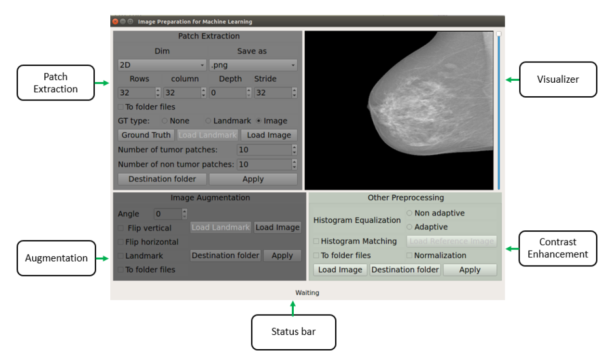

# Image Preparation for Machine Learning
This software contains the most commonly
used image preprocessing (histogram matching, histogram qualization, normalization), Patch extraction ( 2D, 2,5D, 3D) and augmentation techniques to apply machine learning and deep learning in amedical image taking into consideration different ground truth types. It has also a visualzation tool to visualize 2D and 3D images.

## Libraries Used
The code has been tested with the following configuration

- nibabel == 2.1.0
- nipype == 0.12.1
- python == 3.6
- scipy == 0.19.0
- sckit-image == 0.13.0
- sckit-learn == 0.18.1
- Pydicom == 0.9.9
- OpenCV-Python == 3.4.0
- PyQt5
- Qimage2ndarray == 1.6

## How to run 
* Run main.py file

## Results

## More detail about the project can be found in report.pdf file.
